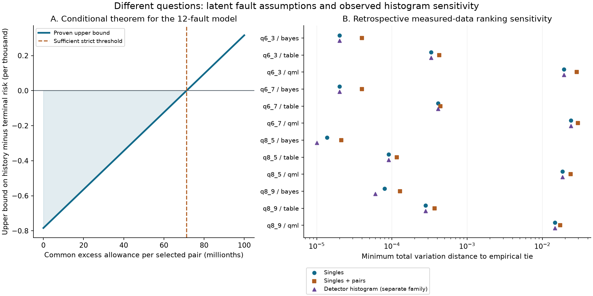

# Correlation sensitivity: working research note

3 October 2026. [Read the brief](RESEARCH_BRIEF.md) or [full working note](PAPER.md). [Exact empirical results](EMPIRICAL_RESULTS.csv) accompany the note.

This public documentation describes a bounded study. The complete local replay archive, raw retained subset, model outputs, and machine receipts are available from the author for review; they are not distributed in this public overview repository. File names in the working note refer to that separate package.

The left plot is a proven bound under explicit assumptions in a small mathematical model. The right plot reports descriptive sensitivity of previously exposed measured histograms. It does not establish that the latent fault assumptions hold on hardware. The detector-histogram family is not nested with the other two constraint families. All quantum-inspired table comparisons favor matching on these retained patches.

Five-host Python/MATLAB checks and six GPU numerical replays passed. The first model panel had errors; its separately bounded retry completed, with scientific corrections retained. Neither computation agreement nor model consensus is external peer review.

Novelty and publication suitability remain unresolved. No new quantum job, hardware advantage, award or institutional endorsement is claimed. The immediate question is whether the selected latent moments can be connected to identifiable, statistically bounded calibration measurements on a realistic extraction circuit.
