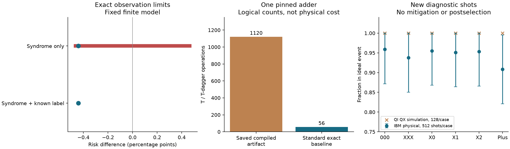

# Observation limits and compilation checks

3 October 2026 · OBSERVABLE-20261003 · AI-assisted working note, human review pending

[Two-page result brief](ASTERION_OBSERVABLE_Research_Brief.pdf) · [Working note](PAPER.md) · [Validation guide](VALIDATION.md) · [One-page adder question](ASTERION_Adder_Review_Brief.pdf)

This bounded study asks what recorded syndromes can establish about a frozen decoder comparison. In a 4,096-state example, two fault laws can preserve the complete syndrome distribution and the stated rate intervals while reversing the decoder ranking. The exact minimum total-variation distance to a tie is 0.0022031647031184. The argument uses established finite optimization methods; novelty remains unresolved.

The same study freshly replayed 200,000 previously exposed Google Quantum AI measurements. Its 36 calibration settings and 72,000 simulated resamples established no decoder improvement and no physical-shot saving. A separate audit of one pinned PNNL adder compares its saved 1,120-T artifact with a known exact 56-T/T-dagger baseline. This is not a novel compiler or a demonstrated defect in the current tool; the saved artifact's generating tolerance remains unknown.

New provider checks comprise 3,072 physical IBM shots and 768 Quantum Inspire QX emulator shots, with all counts retained. Physical QI hardware was unavailable. These small diagnostics do not validate the mathematical noise model or establish fault tolerance or quantum advantage.

Independent Python and MATLAB implementations passed. MATLAB ran on five hosts; RTX 5090 and RTX 4090 replayed the complete compiled unitary. These checks are operated within one project and are not independent human peer review.

## Evidence access

This public folder contains the manuscript and summaries, not the complete offline review package. Paths and receipt names in the manuscript refer to that package. The sealed package includes the exact checker, selected public source data, attribution, recorded provider results and corruption controls. It is available from the author for a narrow review request. The validation guide explains its offline replay. No provider jobs are needed to reproduce it.

Archive: `ASTERION_OBSERVABLE_REVIEW_20261003T195519Z.zip` (2,590,195 bytes, 223 members).

SHA-256: `aaeddf8d5557af3e478b9831a55dd5c100d0fa1b24dc695b9fe04301558cbede`.

A fresh extraction passed the full recorded-data replay. Altered bytes and a rehashed false bound were both rejected. A checksum establishes consistency, not authorship or scientific acceptance.

## Most useful feedback

Is this finite observation example a useful regression case? Which synthesis tolerance and tool revision produced the pinned PNNL adder artifact? The next step is expert feedback on these narrow questions. No further QPU campaign is justified by these results alone.

The DOE roadmap motivates careful verification and resource accounting. It does not imply DOE affiliation, funding, endorsement, or publication acceptance.
